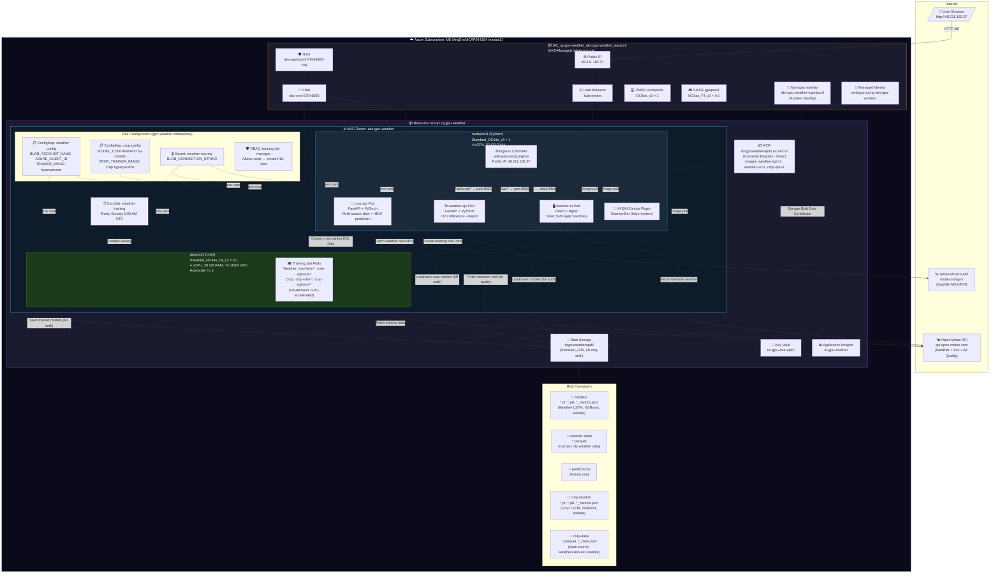
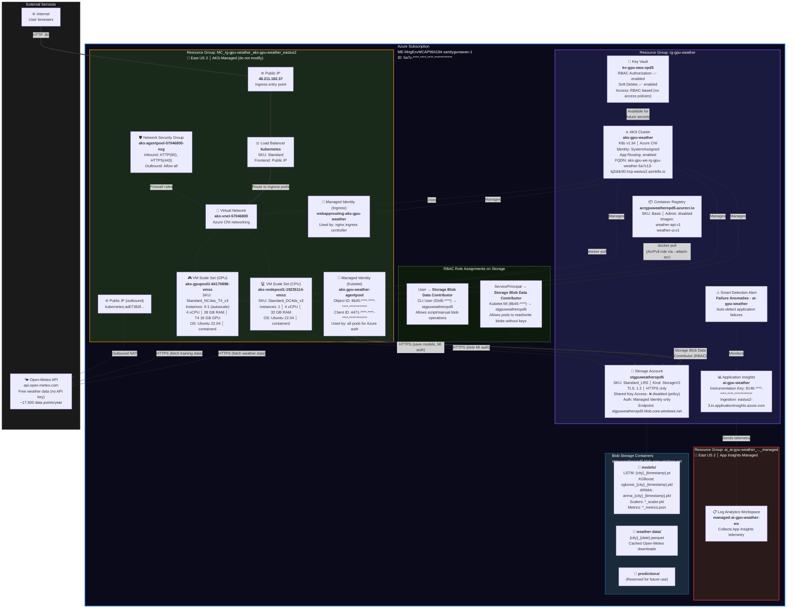

# GPU Weather & Crop Health Prediction - Application Flow Guide

## Architecture Diagram



## Resource Inventory

### Resource Group: `rg-gpu-weather` (User-Managed)

| Resource | Type | SKU/Size | Purpose |
|----------|------|----------|---------|
| `aks-gpu-weather` | Kubernetes Service | - | AKS cluster orchestrating all workloads |
| `acrgpuweatheropd5` | Container Registry | Basic | Stores Docker images (weather-api:v1, weather-ui:v1) |
| `stgpuweatheropd5` | Storage Account | Standard_LRS | Blob storage for models, weather data cache, predictions |
| `kv-gpu-wea-opd5` | Key Vault | Standard | Secrets management |
| `ai-gpu-weather` | Application Insights | - | Monitoring and telemetry |

### Resource Group: `MC_rg-gpu-weather_aks-gpu-weather_eastus2` (AKS-Managed)

| Resource | Type | Purpose |
|----------|------|---------|
| `aks-nodepool1-*-vmss` | VM Scale Set | CPU node pool (DC4ds_v3 × 1) |
| `aks-gpupool1-*-vmss` | VM Scale Set | GPU node pool (NC4as_T4_v3 × 0-1, autoscale) |
| `aks-vnet-57046800` | Virtual Network | Cluster networking (Azure CNI) |
| `aks-agentpool-*-nsg` | Network Security Group | Firewall rules for nodes |
| `kubernetes` | Load Balancer | Routes external traffic to ingress |
| Public IP (48.211.182.37) | Public IP | Ingress entry point |
| `aks-gpu-weather-agentpool` | Managed Identity | Kubelet identity (Blob access via RBAC) |
| `webapprouting-aks-gpu-weather` | Managed Identity | Ingress controller identity |

### Kubernetes Resources (`gpu-weather` namespace)

| Resource | Kind | Details |
|----------|------|---------|
| `weather-api` | Deployment | 1 replica, FastAPI + PyTorch, CPU node |
| `weather-ui` | Deployment | 1 replica, React + Nginx, CPU node |
| `crop-api` | Deployment | 1 replica, FastAPI + PyTorch + multi-source fetchers, CPU node |
| `weather-api-svc` | Service | ClusterIP :8000 |
| `weather-ui-svc` | Service | ClusterIP :80 |
| `crop-api-svc` | Service | ClusterIP :8001 |
| `weather-ingress` | Ingress | webapprouting class, routes /, /api/*, /api/crop/* |
| `weather-training` | CronJob | Weekly weather retraining (Sunday 2 AM UTC) |
| `weather-config` | ConfigMap | Weather: BLOB_ACCOUNT_NAME, AZURE_CLIENT_ID, TRAINER_IMAGE |
| `crop-config` | ConfigMap | Crop: MODEL_CONTAINER=crop-models, CROP_TRAINER_IMAGE |
| `weather-secrets` | Secret | BLOB_CONNECTION_STRING (shared by both apps) |
| `training-job-manager` | Role + RoleBinding | Allows API pods to create training K8s Jobs |

### Blob Storage Containers

| Container | Contents |
|-----------|----------|
| `models/` | Weather trained models: `*.pt` (LSTM), `*.pkl` (XGBoost/ARIMA/scalers), `*_metrics.json` |
| `weather-data/` | Cached weather data as `.parquet` files (per city) |
| `predictions/` | Reserved for future prediction storage |
| `crop-models/` | Crop trained models: `*.pt` (LSTM), `*.pkl` (XGBoost/ARIMA/scalers), `*_metrics.json` |
| `crop-data/` | Multi-source crop data: `.parquet` (weather+soil+air+satellite), `*_meta.json` |

### Authentication & Identity

| Identity | Scope | Role | Purpose |
|----------|-------|------|---------|
| Kubelet MI (`4471-****-****-****-************`) | `stgpuweatheropd5` | Storage Blob Data Contributor | Pod access to Blob Storage without keys |
| CLI User | `stgpuweatheropd5` | Storage Blob Data Contributor | Script/manual blob access |
| Kubelet MI | `acrgpuweatheropd5` | AcrPull (via --attach-acr) | Pull container images from ACR |

---

## Network Flow Diagram

```
Internet (User Browser)
    │
    ▼
Public IP: 48.211.182.37 ──► Azure Load Balancer
    │
    ▼
Ingress Controller (nginx, webapprouting)
    │
    ├── GET /          ──► weather-ui-svc:80    ──► React SPA (static files)
    │
    └── GET/POST /api/* ──► weather-api-svc:8000 ──► FastAPI Backend
                                │
                                ├──► Open-Meteo API (outbound HTTPS)
                                ├──► Azure Blob Storage (MI auth, HTTPS)
                                └──► K8s API (in-cluster, create training jobs)
```

---

## Azure Infrastructure Diagram



### Azure Service Connection Matrix

| From | To | Protocol | Auth Method | Purpose |
|------|-----|----------|-------------|---------|
| Internet | Public IP (48.211.182.37) | HTTP :80 | None (public) | User access to web app |
| Load Balancer | Ingress Controller | TCP | Internal | Route traffic to nginx pods |
| Ingress | weather-ui-svc | HTTP :80 | Internal ClusterIP | Serve React SPA |
| Ingress | weather-api-svc | HTTP :8000 | Internal ClusterIP | API requests |
| weather-api Pod | Open-Meteo API | HTTPS :443 | None (public API) | Fetch real-time weather data |
| weather-api Pod | Blob Storage | HTTPS :443 | Managed Identity (MI) | Load/save models, read cached data |
| weather-api Pod | K8s API Server | HTTPS :443 | ServiceAccount token | Create training batch jobs |
| Training Job Pod | Open-Meteo API | HTTPS :443 | None (public API) | Fetch training data (1-2 years) |
| Training Job Pod | Blob Storage | HTTPS :443 | Managed Identity (MI) | Save trained model artifacts |
| VMSS (nodes) | ACR | HTTPS :443 | AcrPull (via Kubelet MI) | Pull container images |
| App Insights | Log Analytics Workspace | Internal | Azure-managed | Store telemetry & logs |
| Smart Detection | App Insights | Internal | Azure-managed | Monitor for failure anomalies |

### Identity & Access Summary

```
┌─────────────────────────────────────────────────────────────────────────┐
│                        IDENTITY CHAIN                                   │
├─────────────────────────────────────────────────────────────────────────┤
│                                                                         │
│  AKS Control Plane                                                     │
│  └── System-Assigned MI (bf34-****-****-****-************)              │
│       └── Manages cluster operations, node provisioning                │
│                                                                         │
│  AKS Kubelet (Node-level)                                              │
│  └── User-Assigned MI: aks-gpu-weather-agentpool                       │
│       ├── Object ID: 8b45-****-****-****-************                  │
│       ├── Client ID: 4471-****-****-****-************                  │
│       ├── ROLE: Storage Blob Data Contributor → stgpuweatheropd5       │
│       ├── ROLE: AcrPull → acrgpuweatheropd5 (via --attach-acr)        │
│       └── Injected as AZURE_CLIENT_ID env var in all pods              │
│                                                                         │
│  Web App Routing                                                        │
│  └── User-Assigned MI: webapprouting-aks-gpu-weather                   │
│       └── Manages ingress controller, DNS, TLS                         │
│                                                                         │
│  CLI User (interactive)                                                 │
│  └── Object ID: 50d5-****-****-****-************                       │
│       └── ROLE: Storage Blob Data Contributor → stgpuweatheropd5       │
│                                                                         │
│  K8s RBAC (in-cluster)                                                 │
│  └── ServiceAccount: gpu-weather/default                               │
│       └── Role: training-job-manager                                   │
│            └── Permissions: create/get/list/watch/delete batch/jobs    │
│                             get/list pods, pods/log                    │
│                                                                         │
│  Key Vault: kv-gpu-wea-opd5                                           │
│  └── RBAC Authorization: enabled (no access policies)                  │
│  └── No roles assigned yet (available for future secrets)              │
│                                                                         │
│  Storage: stgpuweatheropd5                                             │
│  └── Shared Key Access: DISABLED (Azure policy enforced)               │
│  └── All access via Managed Identity + RBAC only                       │
│                                                                         │
└─────────────────────────────────────────────────────────────────────────┘
```

### Data Flow: Training Pipeline (Azure View)

```
┌──────────────┐     ┌──────────────────┐     ┌─────────────────────────────┐
│  User clicks │     │  weather-api Pod  │     │  K8s API Server             │
│  "Train All" │────►│  (CPU nodepool1)  │────►│  Creates Job in             │
│  in browser  │     │  POST /api/train  │     │  gpu-weather namespace      │
└──────────────┘     └──────────────────┘     └───────────┬─────────────────┘
                                                          │
                                                          ▼
                                              ┌───────────────────────────┐
                                              │  AKS Autoscaler           │
                                              │  Detects pending GPU pod  │
                                              │  Scales gpupool1: 0 → 1  │
                                              │  (~3-5 min cold start)    │
                                              └───────────┬───────────────┘
                                                          │
                                                          ▼
┌──────────────────┐     ┌──────────────────────────────────────────────┐
│  Open-Meteo API  │◄────│  Training Pod (GPU gpupool1)                │
│  Fetches 1 year  │     │  NC4as_T4_v3 (T4 16GB GPU)                 │
│  of hourly data  │     │  Image: acrgpuweatheropd5.azurecr.io/       │
└──────────────────┘     │         weather-api:v1                      │
                         │  Trains LSTM/XGBoost/ARIMA                  │
                         │  Uses CUDA on T4 GPU                        │
                         └───────────┬──────────────────────────────────┘
                                     │
                                     ▼
                         ┌───────────────────────────────────────┐
                         │  Azure Blob Storage                   │
                         │  stgpuweatheropd5 (MI auth)           │
                         │                                       │
                         │  Uploads to models/ container:        │
                         │  ├── jakarta_20260403_033820.pt       │
                         │  ├── jakarta_..._scaler.pkl           │
                         │  ├── jakarta_..._metrics.json         │
                         │  ├── xgboost_jakarta_...pkl           │
                         │  └── arima_jakarta_...pkl             │
                         └───────────────────────────────────────┘
                                     │
                                     ▼
                         ┌───────────────────────────────────────┐
                         │  After training completes:            │
                         │  GPU pod terminates                   │
                         │  Autoscaler scales gpupool1: 1 → 0   │
                         │  No GPU cost when idle                │
                         │                                       │
                         │  weather-api loads new model          │
                         │  on next /api/predict request         │
                         └───────────────────────────────────────┘
```

---

## Overview

This application demonstrates GPU-accelerated machine learning on Azure Kubernetes Service (AKS). It contains **two prediction modules** sharing the same infrastructure:

1. **Weather Prediction** — Trains LSTM/XGBoost/ARIMA on hourly weather data from Open-Meteo, serves forecasts via API, includes a natural language weather report generator.
2. **Crop Health Prediction** — Trains LSTM/XGBoost/ARIMA on multi-source daily data (Open-Meteo weather+soil, Open-Meteo air quality, NASA MODIS satellite NDVI/EVI), predicts vegetation health index and stress levels.

Both modules share the same AKS cluster, ACR, blob storage account, and GPU node pool. A unified React frontend provides an app switcher to toggle between modules.

```
User opens browser → App Switcher: [Weather Prediction | Crop Health]

Weather Prediction (5 tabs)
      |
      +--> Tab 1: Forecast -----> GET /api/predict → 7-day hourly forecast chart
      +--> Tab 2: Validation ---> GET /api/validate → Predicted vs Actual + metrics
      +--> Tab 3: Compare ------> GET /api/compare → All models side-by-side
      +--> Tab 4: Report -------> GET /api/report → Natural language weather report + recommendations
      +--> Tab 5: Training -----> GET /api/training/status/all → Model status + retrain

Crop Health (3 tabs)
      |
      +--> Tab 1: Prediction ---> GET /api/crop/predict → NDVI/EVI forecast + stress timeline
      +--> Tab 2: Validation ---> GET /api/crop/validate → Predicted vs actual NDVI
      +--> Tab 3: Training -----> Data download (multi-source) + Train + Live logs + Data preview + XLSX export
```

---

## High-Level Architecture

```
                    INTERNET
                       |
                       v
              +------------------+
              |   AKS Ingress    |
              |   (nginx)        |
              +--------+---------+
                       |
          +------------+------------+
          |                         |
     /api/* routes            / route
          |                         |
          v                         v
   +--------------+         +--------------+
   |  Backend Pod |         | Frontend Pod |
   |  FastAPI     |         | React+Nginx  |
   |  PyTorch     |         | Static files |
   |  (CPU node)  |         | (CPU node)   |
   +--------------+         +--------------+
          |
    +-----+-----+
    |     |     |
    v     v     v
  Open  Blob  LSTM
  Meteo Storage Model
  API   (models, (.pt)
  (data) data)
```

### What Runs Where

| Component | Node | Why |
|-----------|------|-----|
| Frontend (React/Nginx) | CPU node (Standard_DC2ds_v3) | Just serves static HTML/JS/CSS |
| Backend API (FastAPI) | CPU node (Standard_DC2ds_v3) | Inference works on CPU (~500ms); saves GPU cost |
| Training Job (CronJob) | CPU node (any available) | Runs weekly; uses GPU if available, CPU otherwise |
| Ingress Controller | CPU node | Just routes HTTP traffic |
| NVIDIA Device Plugin | GPU node | Exposes GPU to Kubernetes |
| GPU Node | Autoscales 0-1 | Only active during explicit GPU workloads |

**Note**: Backend runs on CPU by default to save ~$12/day. GPU node autoscales to 0 when no GPU pods are scheduled. Training runs on CPU (slower but reliable). To use GPU for inference, switch to `kubectl apply -f k8s/backend-deployment.yaml`.

---

## The Frontend - What Users See

### Tab 1: Forecast (Default View)

**What it shows:**
- 7-day hourly temperature forecast as a line chart (blue line)
- Humidity overlay on right Y-axis (green line)
- Wind speed and precipitation in a secondary chart below
- City selector dropdown (10 preset cities + custom lat/lon)

**How it works internally:**
```
User selects city (or enters custom coordinates)
  --> Frontend calls: GET /api/predict?city=tokyo&days=7&lat=35.68&lon=139.69
  --> Backend loads trained LSTM model from memory
  --> Backend fetches last 7 days of REAL weather from Open-Meteo API
  --> Backend feeds real data through LSTM model on GPU
  --> Model outputs predicted temperature, humidity, wind, rain, pressure
  --> Backend returns JSON array of hourly forecasts
  --> Frontend renders Recharts LineChart
```

**What users can do:**
- Change city from dropdown (New York, London, Tokyo, Sydney, Sao Paulo, Paris, Singapore, Dubai, Mumbai, Jakarta)
- Enter custom coordinates (any lat/lon worldwide)
- Hover over chart to see exact values at any hour
- Data refreshes when city changes

### Tab 2: Model Validation (Backtesting)

**What it shows:**
- Two overlapping lines: Predicted (blue dashed) vs Actual (green solid)
- Last 14 days of data
- 4 metric cards below the chart: MAE, RMSE, R-squared, Bias
- Each card color-coded: green = good, yellow = fair, red = poor
- "Run Validation" button to refresh

**How it works internally:**
```
User clicks "Model Validation" tab (or "Run Validation" button)
  --> Frontend calls: GET /api/validate?city=new-york&lookback_days=14&lat=40.71&lon=-74.01
  --> Backend takes the trained model
  --> Backend fetches weather data for the last 14 days + 7 days before (as input window)
  --> Backend feeds the pre-14-day data through the model
  --> Model predicts what the next 14 days should look like
  --> Backend ALSO fetches what ACTUALLY happened those 14 days (real observed data)
  --> Backend compares predicted vs actual and computes metrics:
        MAE  = average absolute error (target: < 2 degrees C)
        RMSE = root mean square error (target: < 3 degrees C)
        R2   = how much variance explained (target: > 0.7 = 70%)
        Bias = systematic over/under prediction (target: close to 0)
  --> Returns both time series + metrics as JSON
  --> Frontend renders overlay chart + colored metric cards
```

**What users can do:**
- See proof that the model works (or doesn't)
- Click "Run Validation" to re-run with fresh data
- Change city to validate for different locations

**How to interpret the results:**
- Lines close together = model is accurate
- Lines diverge = model missed that weather pattern
- Green metrics = model is performing well
- Red metrics = model needs retraining or more data

### Tab 3: Training Status

**What it shows:**
- Green/red status dot (model loaded or not)
- Last trained date and time
- Model filename (e.g., new-york_20260331_021500.pt)
- Training duration (e.g., 42 minutes)
- Number of training epochs completed
- Final loss value
- Device used (cuda = GPU, cpu = CPU)
- "Retrain Now" button

**How it works internally:**
```
User clicks "Training Status" tab
  --> Frontend calls: GET /api/training/status
  --> Backend reads the latest metrics JSON from Azure Blob Storage
  --> Returns model info as JSON
  --> Frontend displays in a card layout

User clicks "Retrain Now"
  --> Frontend calls: POST /api/training/trigger
  --> Backend returns the kubectl command to create a training job
  --> (In production, this would programmatically create a K8s Job)
```

**What users can do:**
- See when the model was last trained
- See how long training took and how many epochs
- Trigger manual retraining

---

## The Backend - What Happens Inside

### API Endpoints

#### Weather API (weather-api, port 8000)

| Endpoint | Method | What It Does |
|----------|--------|-------------|
| `/api/health` | GET | System status: GPU available? Models loaded? CUDA device? |
| `/api/predict` | GET | Hourly weather forecast for given city/coordinates |
| `/api/validate` | GET | Backtesting — predicted vs actual weather |
| `/api/compare` | GET | Run all models, return side-by-side forecasts |
| `/api/report` | GET | Natural language weather report with daily breakdown, alerts, recommendations |
| `/api/training/status/all` | GET | Training status for all model types |
| `/api/training/trigger` | POST | Create K8s training job |
| `/api/training/jobs` | GET | List active training jobs |
| `/api/data/status` | GET | Check cached weather data |
| `/api/data/download` | POST | Download weather data from Open-Meteo |

#### Crop API (crop-api, port 8001)

| Endpoint | Method | What It Does |
|----------|--------|-------------|
| `/api/crop/health` | GET | Crop service status |
| `/api/crop/predict` | GET | NDVI/EVI vegetation forecast + stress timeline |
| `/api/crop/validate` | GET | Backtesting — predicted vs actual NDVI |
| `/api/crop/compare` | GET | Compare all crop models |
| `/api/crop/training/status/all` | GET | Crop model training status |
| `/api/crop/training/trigger` | POST | Create crop training K8s job |
| `/api/crop/training/jobs` | GET | List active crop training jobs |
| `/api/crop/training/logs/{job}` | GET | Live training pod logs |
| `/api/crop/training/params` | GET | Feature definitions, data sources, hyperparameters |
| `/api/crop/data/status` | GET | Check cached crop data |
| `/api/crop/data/download` | POST | Download from Open-Meteo + NASA MODIS |
| `/api/crop/data/preview` | GET | Paginated data preview with source grouping |
| `/api/crop/data/download-xlsx` | GET | Download cached data as Excel file |
| `/api/crop/data/presets` | GET | Crop location presets (Palm, Rice, Corn, Wheat) |

### Backend Services (Internal)

```
FastAPI App (main.py)
  |
  +--> Routers (HTTP endpoints)
  |      +--> predict.py    --> calls WeatherPredictor
  |      +--> validate.py   --> calls ModelValidator
  |      +--> training.py   --> calls BlobStorageService
  |
  +--> Services (business logic)
  |      +--> WeatherPredictor  --> loads model, runs inference
  |      +--> ModelValidator    --> backtesting logic
  |      +--> ModelTrainer      --> training loop
  |      +--> WeatherDataFetcher --> Open-Meteo API client
  |      +--> BlobStorageService --> Azure Blob upload/download
  |
  +--> Models
         +--> WeatherLSTM (nn.Module) --> the neural network
```

---

## Training - How It Works

### What is Training?

Training is the process where the LSTM neural network learns weather patterns from historical data. Think of it like studying for an exam -- the model reads 2 years of past weather and learns patterns like:
- "Temperature usually drops after humidity spikes"
- "Wind speed follows seasonal cycles"
- "Pressure changes predict precipitation"

### When Does Training Happen?

| Trigger | How | GPU Needed? |
|---------|-----|-------------|
| **Initial setup** | `build-and-deploy.ps1` creates a K8s Job | Yes |
| **Weekly automatic** | CronJob runs every Sunday 2:00 AM UTC | Yes (GPU autoscales from 0 to 1) |
| **Manual retrain** | Click "Retrain Now" in UI or run kubectl command | Yes |
| **New city** | Run `python -m scripts.train --city tokyo --lat 35.68 --lon 139.69` | Yes |

### Training Flow (Step by Step)

```
Training Job starts on GPU node
  |
  v
[1] FETCH DATA
  |  Call Open-Meteo API for 2 years of hourly data
  |  (temperature, humidity, wind, precipitation, pressure)
  |  Free API, no key needed, ~17,500 data points
  |
  v
[2] PREPARE DATA
  |  Normalize all values to 0-1 range (MinMaxScaler)
  |  Create sliding windows:
  |    Input:  168 consecutive hours (7 days)
  |    Target: next 24 hours
  |  Split: 80% training, 20% testing
  |  Create PyTorch DataLoaders (batch size 64)
  |
  v
[3] TRAIN MODEL
  |  For each epoch (up to 50):
  |    For each batch of 64 windows:
  |      Feed input through LSTM on GPU
  |      Compare output to actual target (MSE loss)
  |      Adjust model weights (backpropagation)
  |    Evaluate on test set
  |    If test loss stops improving for 10 epochs: stop early
  |  
  |  On T4 GPU: ~30-60 minutes
  |  On CPU:    ~4-8 hours
  |
  v
[4] SAVE MODEL
  |  Upload to Azure Blob Storage:
  |    models/new-york_20260331_021500.pt        (model weights, ~5MB)
  |    models/new-york_20260331_021500_scaler.pkl (normalization params)
  |    models/new-york_20260331_021500_metrics.json (training stats)
  |
  v
[5] BACKEND RELOADS
     On next API request, backend detects new model
     Downloads and loads into GPU memory
     Ready to serve predictions
```

### Training a New City

No code changes needed. Just run:

```powershell
# From inside the cluster (K8s Job):
kubectl run train-tokyo -n gpu-weather --rm -it --restart=Never \
  --image=acrgpuweather.azurecr.io/weather-api:v1 \
  -- python -m scripts.train --city tokyo --lat 35.68 --lon 139.69

# Or locally with Docker:
docker run -e BLOB_CONNECTION_STRING="..." weather-api:v1 \
  python -m scripts.train --city tokyo --lat 35.68 --lon 139.69
```

### What Gets Saved After Training

```
Azure Blob Storage (models/ container)
  |
  +--> new-york_20260331_021500.pt           # PyTorch model weights
  +--> new-york_20260331_021500_scaler.pkl   # MinMaxScaler (normalization params)
  +--> new-york_20260331_021500_metrics.json # Training metadata:
  |      {
  |        "city": "new-york",
  |        "lat": 40.71,
  |        "lon": -74.01,
  |        "epochs_completed": 38,
  |        "final_train_loss": 0.003200,
  |        "final_test_loss": 0.004100,
  |        "duration_minutes": 42.3,
  |        "device": "cuda"
  |      }
  |
  +--> tokyo_20260401_100000.pt              # Different city model
  +--> tokyo_20260401_100000_scaler.pkl
  +--> tokyo_20260401_100000_metrics.json
```

---

## Deployment Flow - When Do You Need to Rebuild?

### Scenario: I Changed the Code

```
Code changed (Python or React)
  --> ACR Cloud Build (~7 min backend, ~1 min frontend)
      Sends only source code to Azure, builds in cloud
      No large Docker image upload needed
  --> kubectl rollout restart deployment/weather-api (30 sec rolling update)
  --> No retraining needed (model is in Blob Storage, not in the image)
```

### Scenario: I Want to Retrain with New Data

```
No code change needed! No rebuild needed!
  --> kubectl create job retrain --from=cronjob/weather-training -n gpu-weather
  --> Training pod starts on CPU node
  --> Fetches fresh data from Open-Meteo API
  --> Trains new model (~2 min on GPU, ~30 min on CPU)
  --> Saves to Blob Storage via managed identity
  --> Restart backend to load new model:
      kubectl rollout restart deployment weather-api -n gpu-weather
```

### Scenario: First Time Setup

```
.\setup-infrastructure.ps1          # 15-20 min (creates RG, ACR, AKS, Storage)
  Add GPU pool via Portal/CLI        # 5-10 min (if CLI blocked, use Portal)
.\build-and-deploy.ps1              # 10-15 min (ACR Cloud Build, deploy, train)
                                      Total: ~30-45 min first time
```

### Scenario: Subsequent Deploys (Code Changes Only)

```
.\build-and-deploy.ps1              # ~10 min (ACR cloud build + deploy)
                                      No retraining needed
```

---

## GPU Lifecycle - Save Money

### The Cost Problem

GPU node (T4) costs ~$0.53/hour = ~$12.60/day = ~$380/month if left running 24/7.
But you only need GPU for:
- Training: ~1 hour/week
- Inference: only when users are actively using the app

### The Solution: Autoscaler + Manual Control

**Automatic (already configured):**
- GPU node pool has autoscaler min=0, max=1
- When no GPU pods are scheduled, the node scales to 0 (no cost)
- When a training job or GPU backend pod is scheduled, node scales to 1 (~5 min startup)

**Manual control:**
```powershell
# Deactivate GPU (save ~$12/day)
.\scripts\gpu-activate.ps1 -Action deactivate
  --> Switches backend to CPU deployment (slower but works)
  --> Scales GPU pool to 0 nodes

# Activate GPU (for training or fast inference)
.\scripts\gpu-activate.ps1 -Action activate
  --> Scales GPU pool to 1 node
  --> Waits for node ready
  --> Switches backend to GPU deployment

# Stop everything (save all costs, ~$2/day for storage only)
.\teardown.ps1 -Mode partial
  --> Stops AKS cluster entirely
  --> Resume later: az aks start --name aks-gpu-weather --resource-group rg-gpu-weather

# Delete everything ($0/day)
.\teardown.ps1 -Mode full
```

### Cost Summary

| Mode | GPU | CPU Cluster | Storage | Total/day |
|------|-----|-------------|---------|-----------|
| Full active | ON 24h | ON | ON | ~$15 |
| GPU only for training (1h) | ON 1h | ON | ON | ~$3 |
| CPU only (GPU off) | OFF | ON | ON | ~$2.50 |
| Cluster stopped | OFF | STOPPED | ON | ~$0.06 |
| Everything deleted | - | - | - | $0 |

---

## Data Flow - End to End

### Prediction Request Flow

```
Browser: User selects "Tokyo" from dropdown
  |
  v
Frontend: getForecast("tokyo", 7, 35.68, 139.69)
  |
  v
HTTP: GET /api/predict?city=tokyo&days=7&lat=35.68&lon=139.69
  |
  v
Backend (predict.py router):
  1. Check if model is loaded (cached in memory)
  2. If not, download latest .pt file from Blob Storage
  3. Create WeatherDataFetcher(lat=35.68, lon=139.69)
  |
  v
Open-Meteo API: GET https://api.open-meteo.com/v1/forecast?
                    latitude=35.68&longitude=139.69&
                    hourly=temperature_2m,relative_humidity_2m,...&
                    past_days=8&forecast_days=0
  |
  v
Backend (predictor.py):
  4. Got 192 hours (8 days) of real Tokyo weather
  5. Take last 168 hours (7 days) as model input
  6. Normalize with saved scaler (0-1 range)
  7. Convert to PyTorch tensor, move to GPU
  8. Run LSTM forward pass (< 100ms on GPU)
  9. Get 24-hour prediction
  10. For 7-day forecast: repeat autoregressively
      (feed predictions back as input for next 24h window)
  11. Reverse normalization (back to real degrees C)
  12. Return JSON with 168 hourly predictions
  |
  v
Frontend: Render Recharts LineChart
  - X axis: date/time
  - Y axis left: temperature (blue line)
  - Y axis right: humidity (green line)
  - Secondary chart: wind speed + precipitation
```

### Validation Request Flow

```
Browser: User clicks "Model Validation" tab
  |
  v
Frontend: getValidation("new-york", 14, 40.71, -74.01)
  |
  v
HTTP: GET /api/validate?city=new-york&lookback_days=14&lat=40.71&lon=-74.01
  |
  v
Backend (validator.py):
  1. Fetch 21 days of weather data (14 lookback + 7 input window)
  2. Use first 7 days as model input
  3. Run model autoregressively for 14 days of predictions
  4. Fetch ACTUAL observed weather for those 14 days
  5. Compare predicted vs actual:
     - MAE  = mean(|actual - predicted|)        --> avg error in degrees
     - RMSE = sqrt(mean((actual - predicted)^2)) --> penalizes big misses
     - R2   = 1 - (sum_residuals / sum_total)   --> % variance explained
     - Bias = mean(predicted - actual)           --> systematic error
  6. Return both predicted[] and actual[] arrays + metrics
  |
  v
Frontend: Render overlay chart + MetricsDashboard
  - Green solid line: actual temperature
  - Blue dashed line: predicted temperature
  - 4 metric cards with color coding
```

---

## Use Cases

### Use Case 1: Demo for Customer

**Goal:** Show GPU computing value on Azure

**Script:**
1. "Here's a weather prediction model trained on GPU"
2. Show Forecast tab - "It predicts 7 days of weather for any city"
3. Switch cities to show worldwide support
4. Show Validation tab - "Here's proof it works - predicted vs actual"
5. Point to green metrics - "Less than 2 degrees off on average"
6. Show Training tab - "Trained in 42 minutes on T4 GPU vs 4+ hours on CPU"
7. Show `kubectl get nodes` in terminal - "GPU autoscales to 0 when not needed"

### Use Case 2: Retrain with Fresh Data

**Goal:** Model accuracy is degrading (seasonal change)

1. Check Validation tab - if MAE > 3 or R2 < 0.6, model needs retraining
2. Run: `kubectl create job retrain --from=cronjob/weather-training -n gpu-weather`
3. Wait 30-60 minutes (GPU autoscales up, trains, then scales down)
4. Restart backend: `kubectl rollout restart deployment weather-api -n gpu-weather`
5. Check Validation tab again - metrics should improve

### Use Case 3: Add a New City

**Goal:** Customer wants predictions for Jakarta

1. Open the dashboard
2. Select "Custom coordinates..." from city dropdown
3. Enter: Name="Jakarta", Lat=-6.21, Lon=106.85
4. Click "Go" - forecast appears instantly (using existing model)
5. For better accuracy, train a Jakarta-specific model:
   ```
   kubectl run train-jakarta -n gpu-weather --rm -it --restart=Never \
     --image=acrgpuweather.azurecr.io/weather-api:v1 \
     -- python -m scripts.train --city jakarta --lat -6.21 --lon 106.85
   ```

### Use Case 4: Cost Management

**Goal:** Demo is over, stop spending money

```powershell
# Option A: Just turn off GPU (app still accessible on CPU)
.\scripts\gpu-activate.ps1 -Action deactivate
# Cost: ~$2.50/day

# Option B: Stop entire cluster (resume later with az aks start)
.\teardown.ps1 -Mode partial
# Cost: ~$0.06/day

# Option C: Delete everything
.\teardown.ps1 -Mode full
# Cost: $0/day
```

---

## Component Summary

### Frontend Components

| Component | File | What It Renders |
|-----------|------|----------------|
| App | App.tsx | App switcher (Weather/Crop), tab navigation, header |
| ForecastChart | ForecastChart.tsx | 7-day temperature + humidity line chart |
| ValidationChart | ValidationChart.tsx | Predicted vs actual overlay chart |
| ComparisonChart | ComparisonChart.tsx | All models side-by-side forecast |
| ComparisonValidation | ComparisonValidation.tsx | Model comparison metrics table |
| WeatherReportView | WeatherReportView.tsx | Natural language weather report + daily cards + alerts |
| MetricsDashboard | MetricsDashboard.tsx | Grid of 4 metric cards (MAE, RMSE, R2, Bias) |
| MetricsCard | MetricsCard.tsx | Single metric with color coding |
| TrainingStatus | TrainingStatus.tsx | Weather model status + retrain buttons |
| CitySelector | CitySelector.tsx | Dropdown with 10 cities + custom coordinates |
| ModelSelector | ModelSelector.tsx | LSTM/XGBoost/ARIMA toggle |
| ActivityLog | ActivityLog.tsx | Global event log (shared between both apps) |
| CropSelector | crop/CropSelector.tsx | Crop presets (Palm, Rice, Corn, Wheat) + custom lat/lon |
| CropForecastChart | crop/CropForecastChart.tsx | NDVI/EVI prediction timeline with stress bars |
| CropValidationChart | crop/CropValidationChart.tsx | Predicted vs actual NDVI table + metrics |
| CropTrainingStatus | crop/CropTrainingStatus.tsx | Data download + training + active job monitor + live logs |
| CropDataPreview | crop/CropDataPreview.tsx | Paginated data table (color-coded by source) + XLSX download |

### Backend Services

#### Weather Backend (`aks/backend/`)

| Service | File | What It Does |
|---------|------|-------------|
| WeatherDataFetcher | data_fetcher.py | Calls Open-Meteo API, returns DataFrame of weather data |
| WeatherPredictor | predictor.py | Loads model from Blob, runs inference, returns forecast |
| ModelValidator | validator.py | Backtesting — compares predictions vs actual |
| ModelTrainer | trainer.py | Data prep, training loop, early stopping, saves to Blob |
| BlobStorageService | blob_storage.py | Upload/download models, scalers, metrics to Azure Blob |
| WeatherLSTM | models/lstm_model.py | PyTorch LSTM neural network |
| WeatherXGBoost | models/xgboost_model.py | XGBoost multi-output regressor |
| WeatherARIMA | models/arima_model.py | SARIMAX per-feature model |
| Report Generator | routers/predict.py | Template-based weather report with daily breakdown, alerts, recommendations |

#### Crop Backend (`aks/crop/`)

| Service | File | What It Does |
|---------|------|-------------|
| CropDataFetcher | services/data_fetcher.py | Multi-source: Open-Meteo weather+soil (daily+hourly), air quality |
| SatelliteFetcher | services/satellite_fetcher.py | NASA MODIS NDVI/EVI (16-day → daily interpolation) |
| CropPredictor | services/predictor.py | Loads crop model, runs inference, classifies stress level |
| ModelTrainer | services/trainer.py | 21-feature training (60-day input → 32-day output) |
| BlobStorageService | services/blob_storage.py | Upload/download to crop-models/crop-data containers |
| CropLSTM | models/lstm_model.py | LSTM for daily vegetation data |
| CropXGBoost | models/xgboost_model.py | XGBoost with rolling-window feature engineering |
| CropARIMA | models/arima_model.py | SARIMAX per-feature model |

### Scripts

| Script | What It Does | When to Use |
|--------|-------------|-------------|
| setup-infrastructure.ps1 | Creates Azure resources (AKS, ACR, Storage + crop containers) | First time setup |
| build-and-deploy.ps1 | Builds weather-api, crop-api, weather-ui images; deploys all K8s manifests | After infrastructure ready or code changes |
| build-and-deploy.ps1 -SkipBuild | Deploy only (no Docker build) | When images already in ACR |
| teardown.ps1 -Mode full | Delete everything (both apps) | After demo |
| teardown.ps1 -Mode partial | Stop AKS (resume later) | End of day |
| teardown.ps1 -Mode gpu | Remove GPU pool only | Save GPU costs |
| scripts/gpu-activate.ps1 -Action activate | Start GPU node | Before training/demo |
| scripts/gpu-activate.ps1 -Action deactivate | Stop GPU node | After training/demo |
